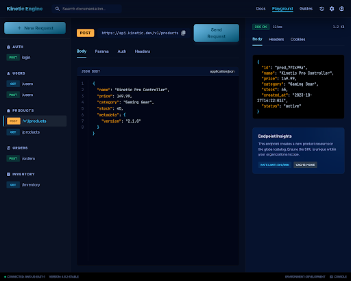

# Inventory Management REST API

A production-style REST API for inventory management built with **Python**, **FastAPI**, and **SQLite**. Features JWT authentication with refresh tokens, full CRUD for products/categories/inventory/orders, pagination with filtering and sorting, an enforced order-status state machine, background low-stock alerts, and auto-generated OpenAPI documentation.

## Screenshot



## Architecture

```
                          +------------------+
                          |   FastAPI App     |
                          |  (app/main.py)   |
                          +--------+---------+
                                   |
              +--------------------+--------------------+
              |                    |                     |
     +--------v--------+  +-------v--------+  +--------v--------+
     |   Middleware     |  |   Auth Layer   |  |   Route Layer   |
     | - CORS          |  | - JWT creation |  | - /auth         |
     | - Request-ID    |  | - bcrypt hash  |  | - /categories   |
     |                 |  | - token decode |  | - /products     |
     +-----------------+  | - get_current_ |  | - /inventory    |
                          |   user dep     |  | - /orders       |
                          +-------+--------+  +--------+--------+
                                  |                     |
                          +-------v---------------------v--------+
                          |         Pydantic V2 Schemas           |
                          | Input validation, OpenAPI generation  |
                          +------------------+-------------------+
                                             |
                          +------------------v-------------------+
                          |       SQLAlchemy 2.0 ORM Layer       |
                          | Mapped columns, relationships, FK    |
                          +------------------+-------------------+
                                             |
                          +------------------v-------------------+
                          |           SQLite (WAL mode)          |
                          |   Foreign keys enforced via PRAGMA   |
                          +--------------------------------------+
```

## Tech Stack

| Layer | Technology |
|---|---|
| Framework | FastAPI 0.115 |
| Language | Python 3.11+ |
| Database | SQLite (zero-config, file-based, WAL mode) |
| ORM | SQLAlchemy 2.0 (mapped columns) |
| Validation | Pydantic V2 |
| Auth | JWT (python-jose) + bcrypt password hashing |
| Testing | pytest + httpx TestClient |

## Quick Start

```bash
# Clone and enter the project
git clone <repo-url>
cd 04-rest-api-backend

# Create a virtual environment (recommended)
python -m venv venv
source venv/bin/activate   # Linux/macOS
venv\Scripts\activate      # Windows

# Install dependencies
pip install -r requirements.txt

# Seed the database with demo data
python seed_data.py

# Start the server
uvicorn app.main:app --reload
```

The API is now running at **http://127.0.0.1:8000**.

- Swagger UI: [http://127.0.0.1:8000/docs](http://127.0.0.1:8000/docs)
- ReDoc: [http://127.0.0.1:8000/redoc](http://127.0.0.1:8000/redoc)

### Demo Credentials

| Username | Password | Role |
|---|---|---|
| `admin` | `admin123` | Admin |
| `alice` | `alice123` | User |
| `bob` | `bob12345` | User |

## API Endpoints

### Authentication

| Method | Endpoint | Description | Auth |
|---|---|---|---|
| `POST` | `/api/v1/auth/register` | Register a new user | No |
| `POST` | `/api/v1/auth/login` | Login and receive JWT tokens | No |
| `POST` | `/api/v1/auth/refresh` | Refresh an expired access token | No |

### Categories

| Method | Endpoint | Description | Auth |
|---|---|---|---|
| `GET` | `/api/v1/categories` | List categories (paginated, searchable, sortable) | No |
| `GET` | `/api/v1/categories/{id}` | Get a single category | No |
| `POST` | `/api/v1/categories` | Create a category | Yes |
| `PUT` | `/api/v1/categories/{id}` | Update a category | Yes |
| `DELETE` | `/api/v1/categories/{id}` | Delete a category | Yes |

### Products

| Method | Endpoint | Description | Auth |
|---|---|---|---|
| `GET` | `/api/v1/products` | List products (paginated, filterable, sortable) | No |
| `GET` | `/api/v1/products/{id}` | Get a single product with category | No |
| `POST` | `/api/v1/products` | Create a product | Yes |
| `PUT` | `/api/v1/products/{id}` | Update a product | Yes |
| `DELETE` | `/api/v1/products/{id}` | Delete a product | Yes |

### Inventory

| Method | Endpoint | Description | Auth |
|---|---|---|---|
| `GET` | `/api/v1/inventory` | List inventory (paginated, low-stock filter) | No |
| `GET` | `/api/v1/inventory/low-stock` | Get all low-stock alerts | No |
| `GET` | `/api/v1/inventory/{id}` | Get a single inventory record | No |
| `POST` | `/api/v1/inventory` | Create an inventory record | Yes |
| `PUT` | `/api/v1/inventory/{id}` | Update an inventory record | Yes |
| `POST` | `/api/v1/inventory/{id}/adjust` | Adjust stock quantity (+/-) | Yes |

### Orders

| Method | Endpoint | Description | Auth |
|---|---|---|---|
| `GET` | `/api/v1/orders` | List orders (paginated, filterable) | Yes |
| `GET` | `/api/v1/orders/{id}` | Get order with line items | Yes |
| `POST` | `/api/v1/orders` | Place an order (validates and deducts stock) | Yes |
| `PATCH` | `/api/v1/orders/{id}/status` | Update order status | Yes |
| `DELETE` | `/api/v1/orders/{id}` | Delete a pending order (restores stock) | Yes |

### Utility

| Method | Endpoint | Description | Auth |
|---|---|---|---|
| `GET` | `/health` | Health check (liveness probe) | No |

## Usage Examples

### Login and get a token

```bash
curl -s -X POST http://127.0.0.1:8000/api/v1/auth/login \
  -H "Content-Type: application/json" \
  -d '{"username": "admin", "password": "admin123"}'
```

Response:
```json
{
  "access_token": "eyJhbGciOiJIUzI1NiIs...",
  "refresh_token": "eyJhbGciOiJIUzI1NiIs...",
  "token_type": "bearer"
}
```

### List products with filters

```bash
# All products, page 1
curl -s http://127.0.0.1:8000/api/v1/products

# Search by name, sorted by price descending
curl -s "http://127.0.0.1:8000/api/v1/products?search=mouse&sort_by=price&sort_order=desc"

# Filter by category and price range
curl -s "http://127.0.0.1:8000/api/v1/products?category_id=1&min_price=20&max_price=100"
```

### Create a product (authenticated)

```bash
TOKEN="your_access_token_here"

curl -s -X POST http://127.0.0.1:8000/api/v1/products \
  -H "Content-Type: application/json" \
  -H "Authorization: Bearer $TOKEN" \
  -d '{
    "sku": "ELEC-099",
    "name": "Bluetooth Speaker",
    "description": "Portable 20W speaker with 12-hour battery",
    "price": 45.99,
    "category_id": 1
  }'
```

### Place an order

```bash
curl -s -X POST http://127.0.0.1:8000/api/v1/orders \
  -H "Content-Type: application/json" \
  -H "Authorization: Bearer $TOKEN" \
  -d '{
    "customer_name": "Acme Corp",
    "customer_email": "orders@acme.com",
    "notes": "Deliver to warehouse entrance",
    "items": [
      {"product_id": 1, "quantity": 5},
      {"product_id": 3, "quantity": 10}
    ]
  }'
```

### Adjust inventory

```bash
# Restock 50 units
curl -s -X POST http://127.0.0.1:8000/api/v1/inventory/1/adjust \
  -H "Content-Type: application/json" \
  -H "Authorization: Bearer $TOKEN" \
  -d '{"adjustment": 50, "reason": "Shipment from supplier received"}'
```

### Check low-stock alerts

```bash
curl -s http://127.0.0.1:8000/api/v1/inventory/low-stock
```

### Order status transition

```bash
# Confirm a pending order
curl -s -X PATCH http://127.0.0.1:8000/api/v1/orders/1/status \
  -H "Content-Type: application/json" \
  -H "Authorization: Bearer $TOKEN" \
  -d '{"status": "confirmed"}'
```

## Key Design Decisions

- **JWT with refresh tokens** -- Access tokens expire in 30 minutes; refresh tokens last 7 days. Both are HS256-signed.
- **Order status state machine** -- Enforced transitions prevent invalid state changes. Cancellation at any non-terminal state restores inventory atomically.
- **Background low-stock alerts** -- After every inventory adjustment, a FastAPI BackgroundTask checks whether stock has dropped below the threshold and logs a warning.
- **Request-ID middleware** -- Every response carries an `X-Request-ID` header for distributed tracing. Clients can pass their own ID to correlate requests.
- **SQLite WAL mode** -- Write-ahead logging enabled for better concurrent read performance. Foreign keys enforced via PRAGMA on every connection.

## Error Handling

All error responses use a consistent shape:

```json
{"detail": "Human-readable error message"}
```

| Status | Meaning |
|---|---|
| 201 | Resource created |
| 204 | Resource deleted (no body) |
| 400 | Business rule violation (insufficient stock, invalid transition) |
| 401 | Invalid or expired token |
| 403 | Missing authentication |
| 404 | Resource not found |
| 409 | Uniqueness conflict (duplicate email, SKU, category name) |
| 422 | Validation error (Pydantic rejects input) |

## Running Tests

```bash
pytest tests/ -v
```

The test suite covers:
- Health check and request-ID middleware
- Registration (success, duplicate email, duplicate username, validation)
- Login (success, wrong password, nonexistent user)
- Token refresh (success, wrong token type, garbage token)
- Auth protection (missing token, invalid token, malformed header)
- Category CRUD (create, read, update, delete, pagination, search, sort, name conflict)
- Product CRUD (create, read, update, delete, filters, price range, SKU conflict, invalid category)
- Inventory (create, adjust, low-stock alerts, insufficient stock, duplicate record)
- Order lifecycle (create, deduct stock, status transitions, cancel-restores-inventory, delete-pending-only)
- Full state machine (all valid transitions, all invalid transitions, terminal states)

## Project Structure

```
app/
  main.py             # FastAPI app, middleware, router registration
  config.py           # Settings via pydantic-settings
  database.py         # SQLAlchemy engine, session, Base
  auth/
    security.py       # Password hashing, JWT creation/verification
    dependencies.py   # get_current_user FastAPI dependency
  models/
    user.py           # User ORM model
    category.py       # Category ORM model
    product.py        # Product ORM model
    inventory.py      # Inventory ORM model
    order.py          # Order + OrderItem ORM models
  schemas/
    common.py         # PaginatedResponse, MessageResponse, ErrorResponse
    user.py           # Auth request/response schemas
    category.py       # Category CRUD schemas
    product.py        # Product CRUD schemas
    inventory.py      # Inventory CRUD + adjustment schemas
    order.py          # Order CRUD schemas
  routes/
    auth.py           # /auth/register, /auth/login, /auth/refresh
    categories.py     # /categories CRUD
    products.py       # /products CRUD
    inventory.py      # /inventory CRUD + adjust + low-stock
    orders.py         # /orders CRUD + status transitions
tests/
  conftest.py         # Shared fixtures (DB setup, auth helpers, seed data)
  test_api.py         # Comprehensive pytest test suite
seed_data.py          # Database seeding script
CONTRACTS.md          # Full API contracts (input/output/pre/post/side effects)
requirements.txt      # Python dependencies
```

## License

MIT
